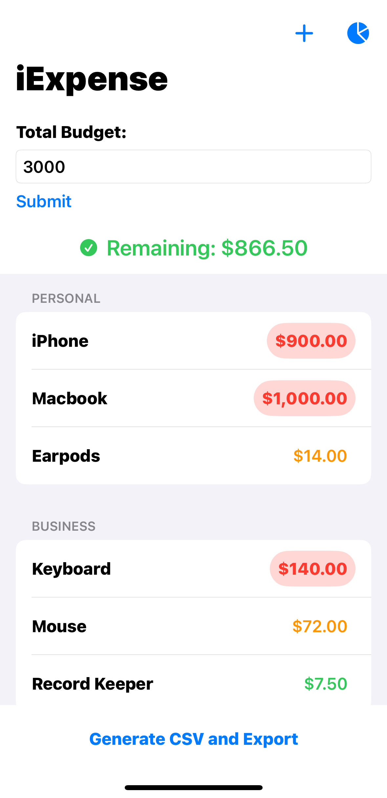
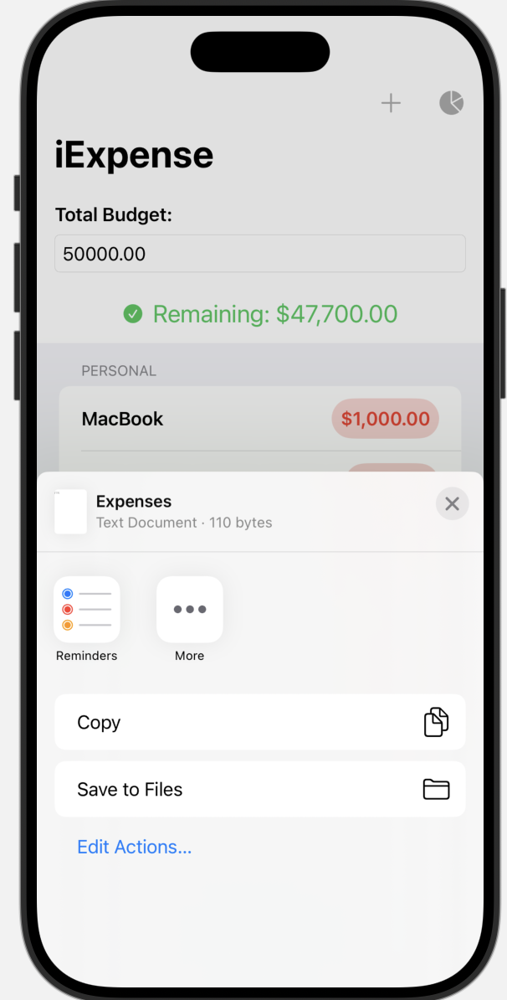
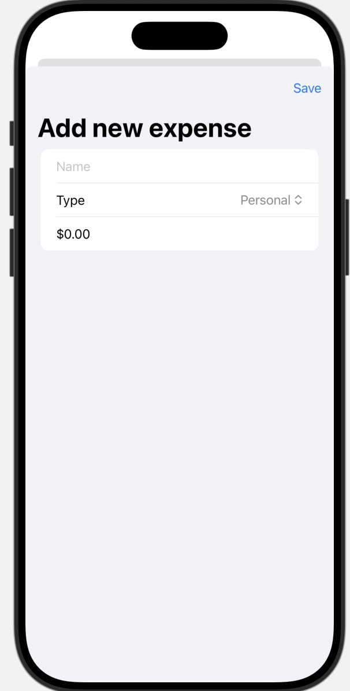
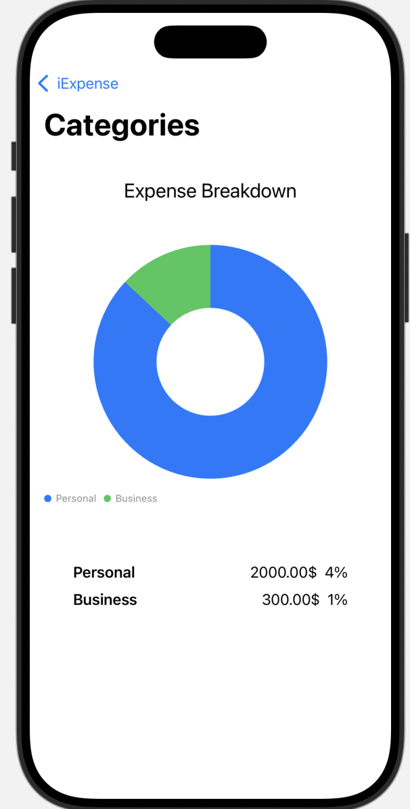
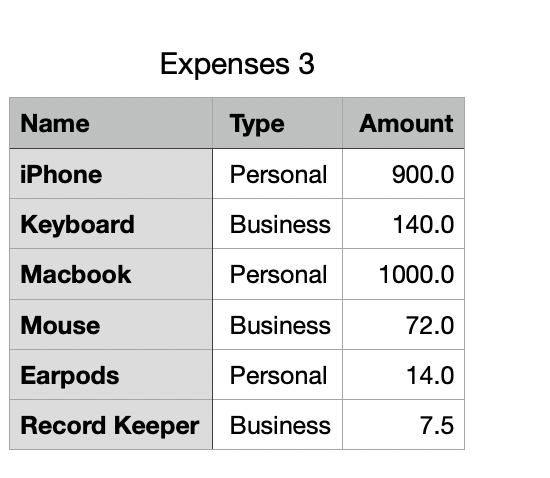

# iExpense

iExpense is a SwiftUI-based expense tracking app that allows users to manage their personal and business expenses efficiently. The app also supports a total budget feature, enabling users to monitor their remaining funds and ensure they stay within their financial limits.

## Features

- **Add Expenses**: Easily add personal or business expenses with details such as name, type, and amount.
- **Expense Categories**: Categorize expenses as either "Personal" or "Business."
- **Total Budget Tracking**: Set a total budget and track the remaining balance dynamically.
- **Data Persistence**: Automatically saves expenses and total budget using `UserDefaults`, ensuring data is retained across app sessions.
- **Visual Indicators**:
  - Green checkmark when the remaining budget is positive.
  - Red warning icon when expenses exceed the total budget.
  - Color-coded expense amounts: green for low amounts, orange for medium, and red for high expenses.
- **Dynamic List Views**: View categorized expenses in a user-friendly list format.
- **Delete Expenses**: Swipe to delete expenses in either category.
- **Chart View**: Expenses breakdown through a donut chart
- **Export Expenses**: Functionality to export the expenses to a csv file

## Screenshots











## Technologies Used

- **Swift**
- **SwiftUI**
- **Observation Framework**
- **UserDefaults** for data persistence
- **Foundation** for data encoding and decoding
- **Charts** for expenses breakdown

## Requirements

- iOS 16.0 or later
- Xcode 14 or later

## Installation

1. Clone the repository:
   ```bash
   git clone https://github.com/Soumya98-dev/iExpense.git
   ```
2. Open the project in Xcode:
   ```bash
   cd iExpense
   open iExpense.xcodeproj
   ```
3. Build and run the app on a simulator or a connected device.

## Usage

1. Launch the app.
2. Set your total budget in the provided text field.
3. Add expenses using the "+" button in the navigation bar.
4. View remaining budget dynamically updated as expenses are added.
5. Swipe left on an expense to delete it.

## Code Overview

### ExpenseItem

- Represents a single expense with properties for name, type, and amount.
- Implements `Codable` for data encoding/decoding.

### Expenses (Observable Class)

- Manages a list of expenses.
- Automatically saves and loads data using `UserDefaults`.

### ContentView

- Main interface for managing and viewing expenses.
- Includes budget input and a dynamic list of expenses.

### AddView

- A modal form for adding new expenses to the list.

## Future Enhancements

- Add support for recurring expenses.
- Enable syncing across multiple devices using iCloud.
- Support additional currencies.

## Contributing

Contributions are welcome! Please fork the repository and submit a pull request for any features or bug fixes.

## Contact

For any questions or suggestions, feel free to contact [Soumyadeep Chatterjee](mailto:soumya.dc98@gmail.com).

---

Thank you for using iExpense!
